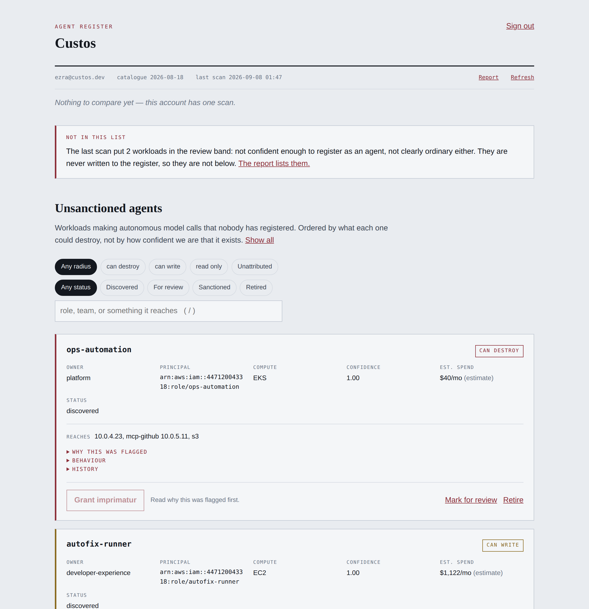
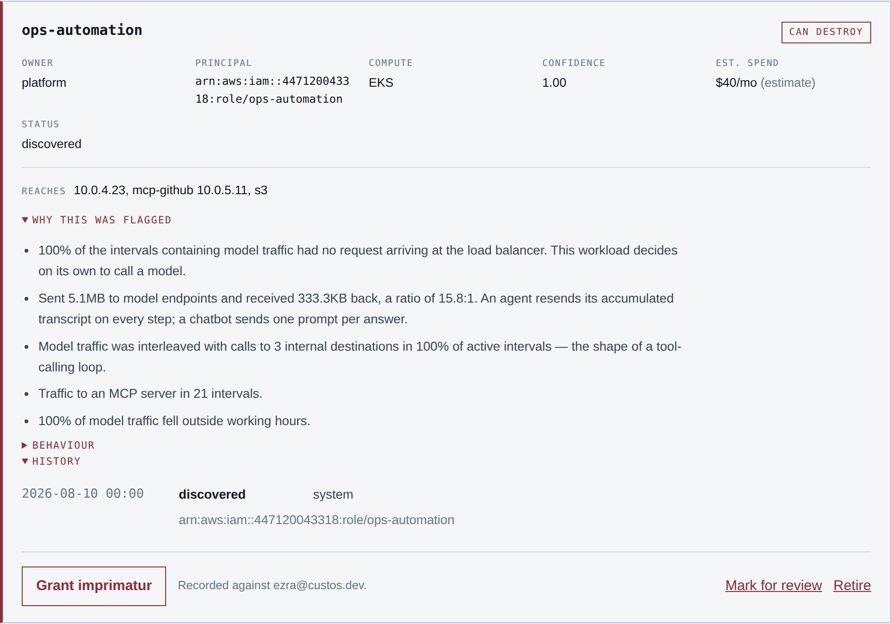
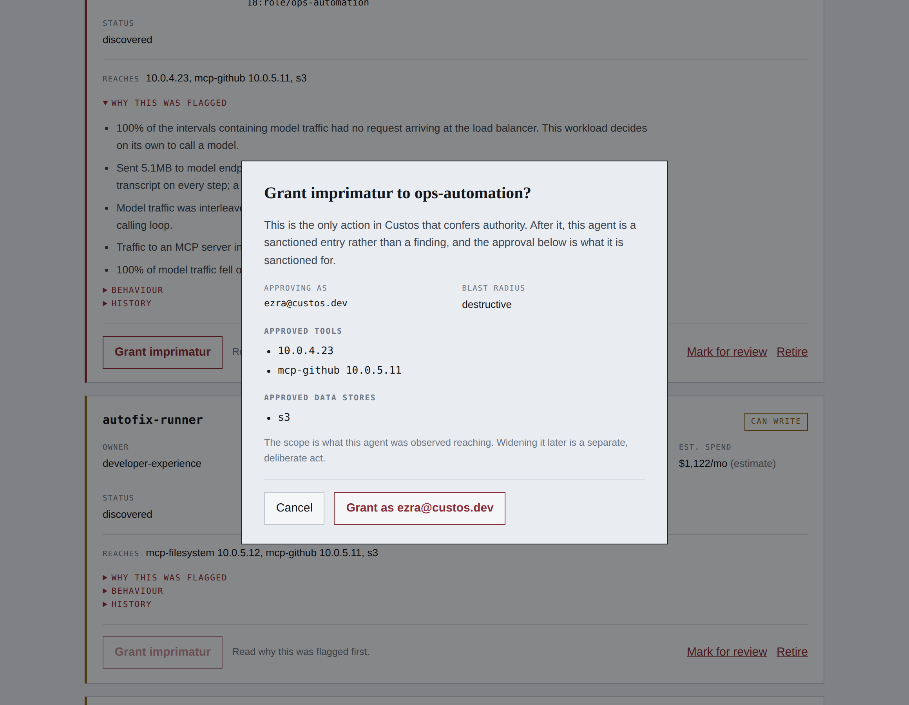

# Custos

**The register of every AI agent running in a company, and the checkpoint that
governs what those agents are permitted to do.**

Companies are running autonomous agents that hold credentials, call tools, and
write to production systems without a human reading each action. Identity
systems decide *which agents may authenticate*. Nobody decides *which actions
are permitted* — and at most companies, nobody can say which agents are running
at all.

Custos does three things, in this order:

1. **See.** Discover agents running in a cloud account, including the ones
   nobody enrolled, from network and identity metadata alone.
2. **Attribute.** Resolve each one to its owner, its credentials, and what it
   can reach.
3. **Stop.** Gate consequential actions against deterministic policy, with a
   signed receipt for every decision.

Only the first two are built. The third is deliberately not started until a
paying customer asks for it.

---

## Status

**Gate G0 passed.** The load-bearing assumption — that an agent is
distinguishable from a chatbot backend using metadata alone — is tested and
holds, with a 0.26 separation margin, full recall, and zero false positives.

Against a harder corpus added afterwards — agents that pause for human
approval, agents on batch schedules, chatbots with function calling — every
verdict is still correct and there are still no false positives, but the margin
falls to **0.14**. That is the number to quote wherever the first one would be
doing work.

The result and its limitations are in [docs/A0-FINDINGS.md](docs/A0-FINDINGS.md).
Two signals the original specification expected to carry the classifier were
measured and rejected; the finding that matters most is that the specification's
headline signal is not implementable at all, and what replaces it is better.

```
make setup       # virtualenv, both Python packages
make check       # lint and test everything
make experiment  # run A0, print the G0 verdict, write a sample scan report
```

## The loop, end to end

```
# In the customer's account: one Terraform apply, read-only role.
# Then, holding their role ARN:
CUSTOS_DRY_RUN=1 ./custos-collector > batch.json    # prints, sends nothing

custos --db acme.db scan batch.json --out report.html
custos --db acme.db register --account 447120043318 --unsanctioned-only
custos --db acme.db diff --account 447120043318     # after the second scan
```

No server is needed for a first scan. `docs/OPERATIONS.md` walks the whole
thing; the control plane API and container image exist for when a customer
wants continuous monitoring.

Run `./custos-collector --check` before the first scan. Every onboarding
failure produces the same symptom — a report with no findings — and `--check`
names which one it is before an hour is spent reading an empty report.

## What it looks like

The console is the operator surface: read the findings, read the evidence,
sanction an agent. It is served by the control plane at `/`, so there is one
process and one port.

Findings are ordered by **what each agent could destroy**, not by how confident
the classifier is that it exists. Below, `ops-automation` sits above
`autofix-runner` at identical 1.00 confidence and a twenty-eighth of the spend,
because one holds a role that can delete things and the other does not.



Every finding carries the sentences the classifier produced, and the grant
control stays disabled until they have actually been opened. A console that
makes sanctioning easier than reading upholds SEC-17 in code while defeating it
in practice — the register becomes a rubber stamp and every downstream
guarantee rests on a click nobody thought about.



Granting imprimatur is the only action in the entire system that confers
authority, so it shows what is being approved and whose name goes on the
record. The scope defaults to what the agent was observed reaching; widening it
is a separate, deliberate act.



These are the real console against a real scanned database, but the traffic is
the A0 synthetic corpus rather than a customer account — nobody has run this
against an account we did not build. Regenerate them with `make screenshots`.

The scope names what it can. `billing-api 10.0.4.21` comes from the ENI behind
that address, `rds 10.0.9.45` from the description AWS writes itself, `s3` from
the flow log's own service annotation — and `s3` has no address because service
addresses rotate, so an approval recorded against one is stale within days.

What it cannot name it leaves as an address. `10.0.4.23` is an ENI nobody
tagged, and an honest address beats an invented name. Every real account has
some, which is why the corpus has one too.

## Layout

| Path | Language | What it is |
|---|---|---|
| `collector/` | Go | Runs in the customer's account under a read-only role. Reads VPC Flow Logs from CloudWatch or S3, resolves interfaces to principals, enumerates IAM capability. Apache-2.0. |
| `controlplane/` | Python | Classifier, register, attribution, reach, report. |
| `a0/` | Python | The G0 experiment: synthetic telemetry and evaluation. |
| `checkpoint/` | Go | Inline enforcement gateway. Not started. |
| `console/` | TypeScript | The register in a browser: read the findings, read the evidence, sanction an agent. Served by the control plane at `/`. |

The control plane holds the classifier, the register and its SQLite store,
attribution, reach, baselines, scan comparison, delivery to Slack and SIEM, the
HTTP API, the `custos` CLI, and — when `console/dist` has been built — the
console itself, mounted at `/` behind every API route. The collector reads VPC
Flow Logs from CloudWatch or S3 and load balancer access logs, resolves network
interfaces to principals across EC2, Lambda, ECS, and CloudTrail, enumerates
IAM capability, and runs either once or on a schedule.

| Topic | Document |
|---|---|
| What A0 measured | [docs/A0-FINDINGS.md](docs/A0-FINDINGS.md) |
| Where this stands | [docs/STATUS.md](docs/STATUS.md) |
| Running a scan | [docs/OPERATIONS.md](docs/OPERATIONS.md) |
| Turning a finding into a ticket | [docs/ATTRIBUTION.md](docs/ATTRIBUTION.md) |
| Getting findings to a human | [docs/DELIVERY.md](docs/DELIVERY.md) |
| Running continuously | [docs/SCHEDULING.md](docs/SCHEDULING.md) |
| Answering a security review | [docs/SECURITY-REVIEW.md](docs/SECURITY-REVIEW.md) |
| The API | [docs/API.md](docs/API.md) |
| The console | [console/README.md](console/README.md) |

Language choices and their reasoning: [docs/adr/0001-language-choices.md](docs/adr/0001-language-choices.md).

The collector is open source and everything else is not. That is a commercial
decision rather than a philosophical one: it is the only component that runs
inside customer infrastructure, and its auditability is what clears security
review.

## The invariants

Eight, all testable, none relaxable for a feature request. Each names the test
that enforces it in [docs/SECURITY-INVARIANTS.md](docs/SECURITY-INVARIANTS.md).

| | |
|---|---|
| **SEC-16** | Discovery is read-only. Enforced in the IAM policy *and* in code. |
| **SEC-17** | Discovered records confer no authority. One function can sanction, and it needs a human. |
| **SEC-18** | Metadata only. Enforced by wire types having no field that can hold a payload. |
| **SEC-19** | The collector is inert without an explicit destination. |
| **SEC-20** | A finding without an owner is segregated, never mixed into owned findings. |
| **SEC-21** | Logs follow the same rule as the wire: nothing describing a person. |
| **SEC-22** | A collection window is shortened, never silently truncated. |
| **SEC-23** | Only names matching a shape AWS writes leave the account; free text does not. |

CI runs those five as their own job, so a failure reads as "an invariant broke"
rather than as one line inside two hundred passing tests.

SEC-18 is worth reading the code for. It is not a redaction step — a redaction
step is a filter, filters have bugs and configuration, and a reviewer is right
not to trust one. There is simply no field on any wire type capable of holding a
prompt, and `ship.Send` accepts nothing but those types. Two files establish the
entire privacy claim.

## Try the collector without giving it anything

```
cd collector && go build ./cmd/custos-collector
./custos-collector --explain          # what it reads, sends, and cannot do
./custos-collector                    # unconfigured: does nothing, exits clean
CUSTOS_DRY_RUN=1 CUSTOS_FLOW_LOGS=x \
  ./custos-collector --from-file logs # prints the literal batch, sends nothing
```

Dry run exists for security review. "Show me exactly what you would send" gets a
literal answer rather than a data flow diagram.

## What is deliberately not built

Multi-tenancy, RBAC, and SSO before a paying customer. Key management and
signing infrastructure. Policy authoring UI. Machine-learned classification
before three design partners have produced real traffic. Internet-wide scanning,
which is not possible without a privileged vantage point and inherits the entire
civil-liberties objection the in-account model avoids.

And anything a customer has not asked for by name.
